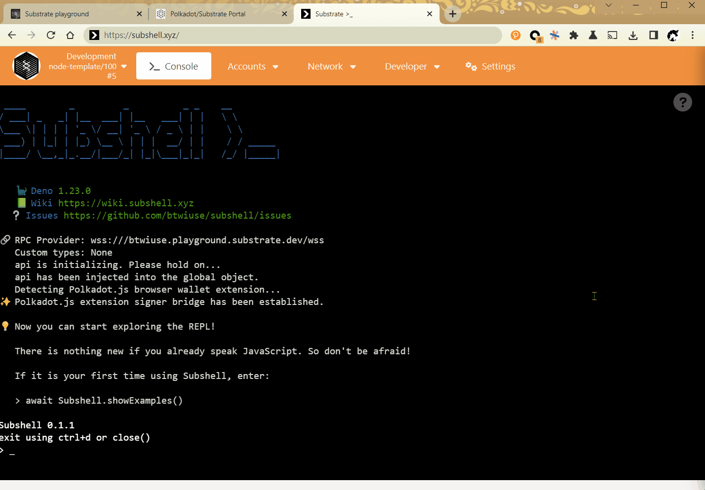

# Subshell [>_](https://subshell.xyz)

Substrate api playground in a Deno 🦕 repl, using Polkadot.js extension wallet as remote signer ✍️. 


Subshell at its core is a TypeScript repl with these preloaded lines:

```typescript
import { ApiPromise, WsProvider } from 'https://deno.land/x/polkadot@0.0.0-9/api/mod.ts';

const provider = new WsProvider(`wss://polkadot.api.onfinality.io/public-ws`);

const api = await ApiPromise.create({ provider});
```

In addition, it supports connecting to your Polkadot.js wallet extension when accessed from the [web interface](https://subshell.xyz). ✨

## Quick Demo



## Give it a try

Visiting [homepage](https://subshell.xyz) will connect to Polkadot.

Use one of the following links to connect to a different chain:  
[Polkadot](https://subshell.xyz/?rpc=wss%3A%2F%2Fpolkadot.api.onfinality.io%2Fpublic-ws#/console)
| [Kusama](https://subshell.xyz/?rpc=wss%3A%2F%2Fkusama.api.onfinality.io%2Fpublic-ws#/console)
| [Moonbeam](https://subshell.xyz/?rpc=wss%3A%2F%2Fmoonbeam.api.onfinality.io%2Fpublic-ws#/console)
| [Acala](https://subshell.xyz/?rpc=wss%3A%2F%2Facala-polkadot.api.onfinality.io%2Fpublic-ws#/console)
| [Litentry](https://subshell.xyz/?rpc=wss%3A%2F%2Facala-polkadot.api.onfinality.io%2Fpublic-ws#/console)
| [Parallel](https://subshell.xyz/?rpc=wss%3A%2F%2Fparallel.api.onfinality.io%2Fpublic-ws#/console)
| [Phala](https://subshell.xyz/?rpc=wss%3A%2F%2Fapi.phala.network%2Fws#/console)
| [Aleph Zero](https://subshell.xyz/?rpc=wss%3A%2F%2Fws.azero.dev#/console)
| [Darwinia](https://subshell.xyz/?rpc=wss%3A%2F%2Frpc.darwinia.network#/console)
| [ChainX](https://subshell.xyz/?rpc=wss%3A%2F%2Fmainnet.chainx.org%2Fws#/console)
| [Edgeware](https://subshell.xyz/?rpc=wss%3A%2F%2Fedgeware.api.onfinality.io%2Fpublic-ws#/console)
| [NFTMart](https://subshell.xyz/?rpc=wss%3A%2F%2Fmainnet.nftmart.io%2Frpc%2Fws#/console)
| ...

Read the [cheatsheet](https://github.com/btwiuse/subshell/wiki/Subshell-Cheatsheet) to get a basic idea of how to use it.

Maintainers of Polkadot.js libraries have made a preview release for Deno under the https://deno.land/x/polkadot namespace. 

You can import them like this in the Deno repl:
```
import { stringToU8a } from 'https://deno.land/x/polkadot@0.0.0-9/util/mod.ts';
```

Subshell sessions run in patched [denoland/deno](https://github.com/denoland/deno) to provide better repl experience. The frontend is based on [polkadot-js/apps](https://github.com/polkadot-js/apps). The modified code will be published soon.


## Motivation

As a long term *nix user who does distro hopping from time to time, I often see (para)chains in the DotSama ecosystem as distros of Parity/Substrate, in the same sense that Arch, Debian, Gentoo, chromeOS and Android are different flavors of GNU/Linux.

(Guess which Linux distro I use the most?)

Taking the analogy a step further, in Linux based systems, once you have mastered the art of shell scripting, it becomes easy to switch between distros.

Likewise, if you are familiar with the Polkadot.js api, you will quickly learn how to play with new chains based on Substrate when they come out.

For the Linux kernel, we have a lot of shells: bash, zsh, fish, ash, dash, csh, ksh, etc. , in which we interactively type commands to perform various kinds of tasks.

While for Substrate, has there been anything like a shell? Yes, [quite a few](#Prior-Art) on the Node.js runtime, but at the same time they all feel not quite there yet.

Reasons:

- You cannot add new imports on demand from a Node.js repl. You have to npm install or add them to your local NODE_PATH first.
- It's painful to deal with cjs / esm incompatibility.
- Hard coding mnemonics / seeds in scripts could lead to potential leak. 
- None of those projects are actively maintained. Polkadot.js libraries version are out of date
- Node.js is not cool any more. It got [rejected](https://medium.com/@imior/10-things-i-regret-about-node-js-ryan-dahl-2ba71ff6b4dc) by its original creator.

Subshell is trying to avoid aforementioned problems by leveraging the power of Deno, a modern runtime for JavaScript and TypeScript.

## Features

Here are Subshell's advantages over Node.js based shells.  

### Accessibility
- Available as a web app, no installation required
- One click away from a drop-in dev terminal in browser

### Compatibility
- Works out of the box with most chains in the DotSama ecosystem
- Plays nice with existing projects, like [Substrate Playground](https://playground.substrate.dev). For example: use [`https://subshell.xyz/?rpc=wss://btwiuse.playground.substrate.dev/wss`](https://subshell.xyz/?rpc=wss://btwiuse.playground.substrate.dev/wss) to connect to my playground dev node.
- `--compat` is turned on by default, so you can still use built-in modules from Node.js
- Added patches to improve the repl experience. The runtime is kept inact. Any Subshell scripts are also valid Deno scripts

In fact, you can load the Subshell init script in Deno. 

```
$　deno repl --unstable --compat --eval-file=https://deno.land/x/subshell@0.0.0-6/init.ts
...
Deno 1.23.0
exit using ctrl+d or close()
> api.tx. # Here tab completion won't show up
```

But it won't tab complete in some circumstances. Subshell used a custom patch to fix that. Plus you lose the ability to connect to browser wallet extension. So the recommend way is to access Subshell from the web interface.

### Customizability

- You can override the init script (soon)
- Custom types can be added the same way in Polkadot.js Apps

### Extensibility

- The decentralized nature of Deno's package import system allows you to load dependencies from url in the repl

### Security
- Sign messages / transactions with Polkadot.js wallet extension. Never make keys leave your wallet again!
- Filesystem / network access can be disabled when you run scripts written by untrusted parties, thanks to [sandboxing in Deno](https://medium.com/deno-the-complete-reference/sandboxing-in-deno-b3d514d88b63)


## Architecture Overview

At first glance, you might think that the Deno repl is running directly inside your browser. That's only an illusion. In fact, there are three parties involved in a Subshell session:

- 🦕: Deno (Rust)
- 🕸️: Relay server (Golang)
- 🌐: Frontend web app (TypeScript)

### Communication mechanism

First, Deno is running as a remote process on a worker container, inside a Pod on Kubernetes, with a persistent bidirectional JSON-RPC connection over WebSocket to the relay server.

🦕⇆🕸️
 
Once you open the web app from your browser, it will similarly establish a connection to the relay.

🌐⇆🕸️

These two connections are then spliced together by the relay server,

🌐⇆🕸️⇆🦕

creating an illusion that your browser is directly connected to Deno, full duplex:

🌐⇆⇆🦕

In full duplex communication, both ends can send and receive data to the other end at the same time.

Since both ends speak JSON-RPC, the browser 🌐 can invoke methods available on the Deno 🦕 side, and vice versa.

You might ask, when could the browser 🌐 become a server? And how is this useful? That is the fun part.

### Remote signer bridge

When Subshell starts, the api object is created from the Deno repl context.

#### The problem

You can query on-chain data using `api.consts.*.*`, `api.query.*.*` etc.

But it becomes clumsy when you want to send transactions with `api.tx.*.*`, because `api` does not come with a default signer.

What if you want to sign data with your own keys?

In your local dev environment it's fine to create a [keyring](https://polkadot.js.org/docs/api/start/keyring/), import your mnemonics / seed and set it as the signer:

```
import { Keyring } from '@polkadot/api';

// Create a keyring instance
const keyring = new Keyring({ type: 'sr25519' });

// Add an account
const alice = keyring.addFromUri('//Alice');

// Set default signer
api.setSigner(alice)
```
But remember:

1. Private keys are supposed to be private.
2. Subshell is running in the cloud.
3. The cloud is just someone else's computer.

So, you should never import your keys to Subshell.

Fortunately, there is a workaround.

Thanks to the work started by __Ian He__ in [polkadot-js/api#660](https://github.com/polkadot-js/api/issues/660), the [Signer](https://github.com/polkadot-js/api/blob/977eb3f9ecb8a2fb57b46b7da7f797b56a9e8bf2/packages/types/src/types/extrinsic.ts#L135-L150) is now an interface, and the polkadot.js extension provides [an implementation](https://github.com/polkadot-js/extension/blob/b858f6eee12a42f570da2e0ee9b5e8f644a4494b/packages/extension-base/src/page/Signer.ts#L12-L45) to it.

We can expose the implementation through the browser 🌐 side JSON-RPC server, and use RemoteSignerBridge as the Signer implementation in Deno 🦕 repl context, where signing requests will be forwarded to the wallet extension via JSON-RPC calls. 

Pseudocode:

```
class RemoteSignerBridge implements Signer {
  signPayload (payload: SignerPayloadJSON) => Promise<SignerResult> {
    return jsonRpcClient.signPayload(payload)
  }
  signRaw (raw: SignerPayloadRaw) => Promise<SignerResult> {
    return jsonRpcClient.signRaw(raw)
  }
  ...
}

api.setSigner(new RemoteSignerBridge())
```

By applying this technique, you can safely do `api.sign`, `api.tx.*.*.signAndSend` in the remote Deno 🦕 repl, and sign it with the Polkadot.js wallet extension in your browser🌐.

## Prior Art

- https://github.com/halva-suite/halva
- https://github.com/cennznet/cli
- https://github.com/compound-finance/gateway/tree/develop/chains
- https://github.com/cryptolab-network/polkadot-api-cli

## LICENSE

```
MIT License

Copyright (c) 2022 btwiuse

Permission is hereby granted, free of charge, to any person obtaining a copy
of this software and associated documentation files (the "Software"), to deal
in the Software without restriction, including without limitation the rights
to use, copy, modify, merge, publish, distribute, sublicense, and/or sell
copies of the Software, and to permit persons to whom the Software is
furnished to do so, subject to the following conditions:

The above copyright notice and this permission notice shall be included in all
copies or substantial portions of the Software.

THE SOFTWARE IS PROVIDED "AS IS", WITHOUT WARRANTY OF ANY KIND, EXPRESS OR
IMPLIED, INCLUDING BUT NOT LIMITED TO THE WARRANTIES OF MERCHANTABILITY,
FITNESS FOR A PARTICULAR PURPOSE AND NONINFRINGEMENT. IN NO EVENT SHALL THE
AUTHORS OR COPYRIGHT HOLDERS BE LIABLE FOR ANY CLAIM, DAMAGES OR OTHER
LIABILITY, WHETHER IN AN ACTION OF CONTRACT, TORT OR OTHERWISE, ARISING FROM,
OUT OF OR IN CONNECTION WITH THE SOFTWARE OR THE USE OR OTHER DEALINGS IN THE
SOFTWARE.
```
